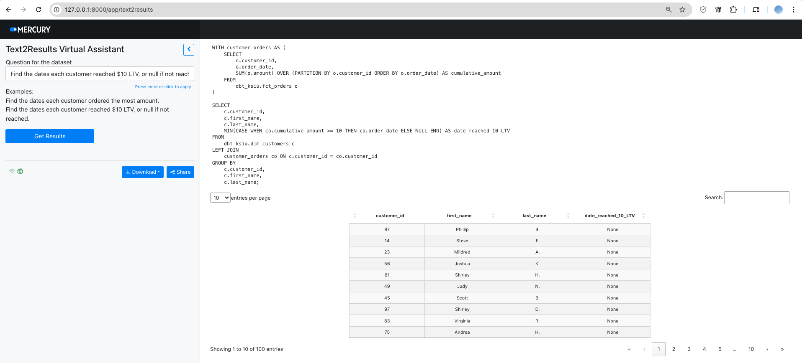

# Overview
This repo intends to hold several dbt projects as well a GenAI web-based app for answering natural language questions regarding the data and display the results.

# Set-up
```
pip install -r requirements.txt
```
Please create a `.env` file with 
```
OPENAI_API_KEY=<your key>
key_path=<GCP service account key with BigQuery permissions>
```

Then go to each dbt project and build the datasets on BigQuery.

# Launch Web App
```
cd text2results_app
mercury run
```
## Demo
