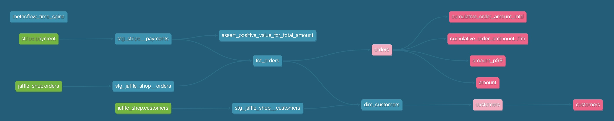
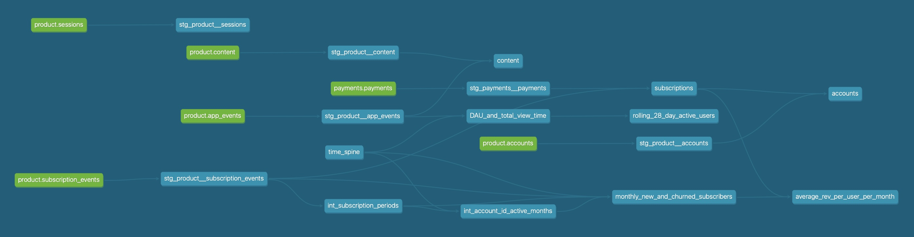
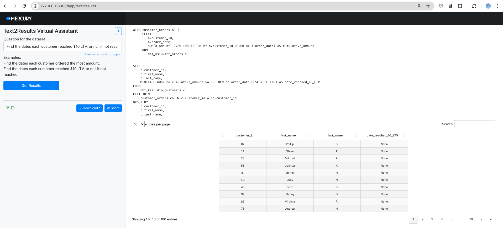

# Overview
This repo intends to hold several dbt projects as well a GenAI web app for answering natural language questions regarding the data using queries generated from the provided data context. 

Model lineage graphs and a sample Looker dashboard utilizing the models are showcased below.

Each dbt project contains more details regarding dbt workflows, semantic layer or business metrics in their own README.

# Set-up
- Set up virtual environment
```
uv sync
```
- Create a `.env` file
```
OPENAI_API_KEY=<your key>
key_path=<GCP service account key with BigQuery permissions>
```
- Run dbt commands in each dbt project to build the models on BigQuery for the web app

# Model Lineage Graphs
```
uv run dbt docs generate
uv run dbt docs serve
```
## jaffle_shop

## subscription_video_streaming_service


# Looker Dashboard
[Sample reporting dashboard consuming data marts for subscription_video_streaming_service](https://lookerstudio.google.com/reporting/afb22a07-5be8-4940-872f-9b9b1adc0896)

# Launch Web App
```
cd text2results
uv run mercury run
```
## Demo
